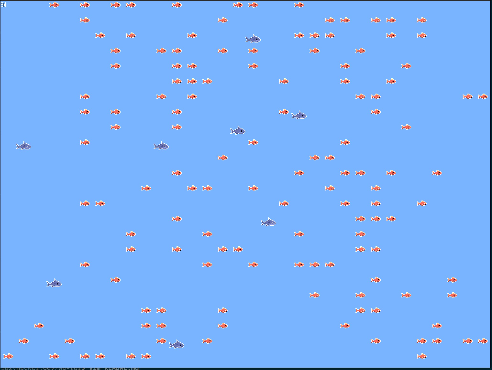

This is an implementation of [Wa-Tor](https://en.wikipedia.org/wiki/Wa-Tor)
using Ebitengine to handle 2D graphics.  This was written as an exercise to
learn [Ebitengine](https://ebitengine.org).

See the demo in your browser at https://www.lazyhacker.com/wa-tor
